> 💡 **提示**：点击下方徽章进入DeepWiki查看详细设计文档    [](https://deepwiki.com/Jenrimark/Health-Management)

# 蝶启新生-健康管理系统

一个基于Spring Boot + Vue.js的全栈健康管理系统，提供个人健康数据管理、营养食谱推荐、健康计划制定、家庭健康管理等功能。

## 📋 目录

- [项目简介](#项目简介)
- [主要功能](#主要功能)
- [技术栈](#技术栈)
- [系统架构](#系统架构)
- [快速开始](#快速开始)
- [项目结构](#项目结构)
- [API文档](#api文档)
- [数据库设计](#数据库设计)
- [部署说明](#部署说明)
- [贡献指南](#贡献指南)
- [许可证](#许可证)

## 🎯 项目简介

蝶启新生健康管理系统是一个现代化的健康管理平台，旨在帮助用户更好地管理个人和家庭的健康状况。系统集成了健康数据记录、智能食谱推荐、运动计划制定、健康报告生成等多项功能，为用户提供全方位的健康管理服务。

## ✨ 主要功能

### 🏠 用户端功能
- **用户管理**：用户注册、登录、个人信息管理
- **健康数据管理**：血压、血糖、体重等健康指标记录与追踪
- **健康计划**：个性化运动计划制定与执行跟踪
- **营养管理**：食谱浏览、营养成分查看、饮食记录
- **健康报告**：健康数据可视化分析与报告生成
- **家庭管理**：家庭成员健康数据共享与管理
- **社交互动**：健康资讯分享、评论互动
- **消息中心**：系统通知、健康提醒

### 🔧 管理端功能
- **用户管理**：用户信息管理、权限控制
- **内容管理**：食谱管理、营养素管理、健康资讯管理
- **数据统计**：用户数据统计、系统使用情况分析
- **系统配置**：健康模型配置、系统参数设置

## 🛠 技术栈

### 后端技术
- **框架**：Spring Boot 2.7.5
- **数据库**：MySQL 8.0
- **ORM**：MyBatis
- **安全认证**：JWT
- **文档处理**：Apache POI、EasyExcel
- **HTTP客户端**：OkHttp、Apache HttpClient
- **JSON处理**：FastJSON2
- **构建工具**：Maven
- **开发工具**：Lombok

### 前端技术
- **框架**：Vue.js 2.6.12
- **UI组件库**：Element UI 2.15.14
- **路由管理**：Vue Router 3.2.0
- **HTTP客户端**：Axios
- **图表库**：ECharts 4.8.0
- **富文本编辑器**：WangEditor
- **加密工具**：CryptoJS、MD5
- **构建工具**：Vue CLI

### 开发环境
- **Java版本**：JDK 1.8+
- **Node.js版本**：14.0+
- **数据库**：MySQL 8.0+

## 🏗 系统架构

```
┌─────────────────┐    ┌─────────────────┐    ┌─────────────────┐
│   前端 (Vue.js)  │────│  后端 (Spring)   │────│  数据库 (MySQL)  │
│                 │    │                 │    │                 │
│ • 用户界面       │    │ • RESTful API   │    │ • 用户数据       │
│ • 数据可视化     │    │ • 业务逻辑       │    │ • 健康记录       │
│ • 交互体验       │    │ • 数据处理       │    │ • 食谱数据       │
└─────────────────┘    └─────────────────┘    └─────────────────┘
```

## 🚀 快速开始

### 环境准备
1. 安装 JDK 1.8+
2. 安装 Node.js 14.0+
3. 安装 MySQL 8.0+
4. 安装 Maven 3.6+

### 数据库初始化
```sql
-- 创建数据库
CREATE DATABASE personal_health CHARACTER SET utf8mb4 COLLATE utf8mb4_bin;

-- 导入数据库结构和初始数据
mysql -u root -p personal_health < personal_health.sql
```

### 后端启动
```bash
cd personal-health-api
mvn clean install
mvn spring-boot:run
```

### 前端启动
```bash
cd personal-heath-view
npm install
npm run serve
```

### 访问系统
- 前端地址：http://localhost:8080
- 后端API：http://localhost:8080/api/personal-heath/v1.0

## 📁 项目结构

```
Health-Management/
├── personal-health-api/          # 后端项目
│   ├── src/main/java/
│   │   └── cn/kmbeast/
│   │       ├── controller/       # 控制器层
│   │       ├── service/          # 服务层
│   │       ├── mapper/           # 数据访问层
│   │       ├── pojo/             # 实体类
│   │       ├── utils/            # 工具类
│   │       └── config/           # 配置类
│   ├── src/main/resources/
│   │   ├── mapper/               # MyBatis映射文件
│   │   └── application.yml       # 配置文件
│   └── pom.xml                   # Maven配置
├── personal-heath-view/          # 前端项目
│   ├── src/
│   │   ├── components/           # 公共组件
│   │   ├── views/                # 页面组件
│   │   ├── router/               # 路由配置
│   │   ├── utils/                # 工具函数
│   │   └── assets/               # 静态资源
│   ├── public/                   # 公共文件
│   └── package.json              # 依赖配置
├── personal_health.sql           # 数据库脚本
└── README.md                     # 项目文档
```

## 📊 数据库设计

### 核心数据表

#### 用户相关
- `user` - 用户基本信息
- `family_relationship` - 家庭关系管理
- `relationship_request` - 关系请求

#### 健康管理
- `health_model_config` - 健康模型配置
- `user_health` - 用户健康数据
- `health_plan` - 健康计划
- `healthy_report` - 健康报告

#### 营养食谱
- `cookbook` - 食谱信息
- `nutriment` - 营养素
- `cookbook_nutriment` - 食谱营养关联
- `diet_history` - 饮食记录
- `category` - 食物分类

#### 社交互动
- `gourmet` - 美食资讯
- `evaluations` - 评论系统
- `interaction` - 用户互动
- `message` - 消息通知

### ER图

```mermaid
erDiagram
    %% 核心用户实体
    USER {
        int id PK
        varchar user_account
        varchar user_name
        varchar user_pwd
        varchar user_avatar
        varchar user_email
        int user_role
        boolean is_login
        boolean is_word
        boolean gender
        int age
        datetime create_time
    }

    %% 健康管理相关实体
    HEALTH_MODEL_CONFIG {
        int id PK
        int user_id FK
        varchar name
        varchar detail
        varchar cover
        varchar unit
        varchar symbol
        boolean is_global
        varchar value_range
    }

    USER_HEALTH {
        int id PK
        int user_id FK
        int health_model_config_id FK
        varchar value
        datetime create_time
    }

    HEALTH_PLAN {
        int id PK
        bigint user_id FK
        date plan_date
        int steps
        int exercise_minutes
        varchar exercise_type
        int calories_burned
        datetime create_time
        datetime update_time
    }

    HEALTHY_REPORT {
        int id PK
        varchar user_account FK
        varchar file_name
        varchar file_path
        varchar file_type
        bigint file_size
        datetime upload_time
        varchar description
        date report_date
        boolean is_deleted
        datetime create_time
        datetime update_time
    }

    %% 食谱与营养相关实体
    CATEGORY {
        int id PK
        varchar name
    }

    COOKBOOK {
        int id PK
        int user_id FK
        varchar cover
        varchar title
        int category_id FK
        longtext content
        boolean is_publish
        datetime create_time
    }

    NUTRIMENT {
        int id PK
        int user_id FK
        varchar name
        varchar detail
        varchar unit
        boolean is_publish
        datetime create_time
    }

    COOKBOOK_NUTRIMENT {
        int id PK
        int cookbook_id FK
        int nutriment_id FK
        varchar value_per_100g
    }

    DIET_HISTORY {
        int id PK
        int user_id FK
        int cookbook_id FK
        varchar detail
        varchar value
        datetime create_time
    }

    GOURMET {
        int id PK
        int user_id FK
        int category_id FK
        varchar title
        longtext content
        varchar cover
        boolean is_audit
        boolean is_publish
        datetime create_time
    }

    %% 社交互动相关实体
    EVALUATIONS {
        int id PK
        int parent_id FK
        int commenter_id FK
        int replier_id FK
        varchar content_type
        int content_id
        varchar content
        longtext upvote_list
        datetime create_time
    }

    EVALUATIONS_UPVOTE {
        int id PK
        int user_id FK
        int evaluations_id FK
    }

    INTERACTION {
        int id PK
        int type
        varchar content_type
        int content_id
        int user_id FK
        int score
        datetime create_time
    }

    MESSAGE {
        int id PK
        varchar content
        int message_type
        int receiver_id FK
        int sender_id FK
        boolean is_read
        int content_id
        datetime create_time
    }

    %% 家庭关系相关实体
    FAMILY_RELATIONSHIP {
        int id PK
        int user_id FK
        int related_user_id FK
        tinyint relationship_type
        tinyint permission_level
        varchar data_access
        datetime create_time
        datetime update_time
        tinyint status
        varchar remark
    }

    RELATIONSHIP_REQUEST {
        int id PK
        int sender_id FK
        int receiver_id FK
        tinyint relationship_type
        tinyint permission_level
        varchar data_access
        varchar request_message
        tinyint request_status
        datetime create_time
        datetime update_time
        varchar remark
    }

    %% 实体间关系
    USER ||--o{ COOKBOOK : "创建"
    USER ||--o{ NUTRIMENT : "创建"
    USER ||--o{ DIET_HISTORY : "记录"
    USER ||--o{ GOURMET : "发布"
    USER ||--o{ HEALTH_MODEL_CONFIG : "配置"
    USER ||--o{ USER_HEALTH : "记录"
    USER ||--o{ INTERACTION : "进行"
    USER ||--o{ EVALUATIONS : "评论(commenter)"
    USER ||--o{ EVALUATIONS : "回复(replier)"
    USER ||--o{ EVALUATIONS_UPVOTE : "点赞"
    USER ||--o{ MESSAGE : "接收(receiver)"
    USER ||--o{ MESSAGE : "发送(sender)"
    USER ||--o{ FAMILY_RELATIONSHIP : "拥有(user)"
    USER ||--o{ FAMILY_RELATIONSHIP : "关联到(related)"
    USER ||--o{ RELATIONSHIP_REQUEST : "发送(sender)"
    USER ||--o{ RELATIONSHIP_REQUEST : "接收(receiver)"

    CATEGORY ||--o{ COOKBOOK : "分类"
    CATEGORY ||--o{ GOURMET : "分类"

    COOKBOOK ||--o{ COOKBOOK_NUTRIMENT : "包含"
    NUTRIMENT ||--o{ COOKBOOK_NUTRIMENT : "被包含于"
    COOKBOOK ||--o{ DIET_HISTORY : "被记录"

    HEALTH_MODEL_CONFIG ||--o{ USER_HEALTH : "被记录"

    EVALUATIONS ||--o{ EVALUATIONS : "父子关系"
    EVALUATIONS ||--o{ EVALUATIONS_UPVOTE : "被点赞"
```



## 📡 API文档

### 用户管理 API
- `POST /user/login` - 用户登录
- `POST /user/register` - 用户注册
- `GET /user/info` - 获取用户信息
- `PUT /user/update` - 更新用户信息

### 健康管理 API
- `GET /health-model-config/query` - 查询健康模型配置
- `POST /health-model-config/save` - 保存健康模型配置
- `POST /user-health/save` - 保存健康数据
- `GET /user-health/query` - 查询健康数据
- `POST /health-plan/save` - 保存健康计划
- `GET /health-plan/queryUser` - 查询用户健康计划

### 营养食谱 API
- `GET /cookbook/query` - 查询食谱
- `POST /cookbook/userSave` - 用户保存食谱
- `GET /nutriment/query` - 查询营养素
- `POST /diet-history/save` - 保存饮食记录

### 社交互动 API
- `GET /gourmet/query` - 查询美食资讯
- `POST /gourmet/save` - 发布美食资讯
- `POST /evaluations/save` - 发表评论
- `GET /evaluations/query` - 查询评论

### 家庭管理 API
- `POST /family-relationship/sendRequest` - 发送家庭关系请求
- `POST /family-relationship/handleRequest` - 处理家庭关系请求
- `GET /family-relationship/getFamily` - 获取家庭成员

## 🚀 部署说明

### 开发环境部署

1. **克隆项目**
```bash
git clone https://github.com/your-username/Health-Management.git
cd Health-Management
```

2. **配置数据库**
```bash
# 修改后端配置文件
vim personal-health-api/src/main/resources/application.yml
# 更新数据库连接信息
```

3. **启动后端服务**
```bash
cd personal-health-api
mvn clean install
mvn spring-boot:run
```

4. **启动前端服务**
```bash
cd personal-heath-view
npm install
npm run serve
```

### 生产环境部署

1. **后端打包**
```bash
cd personal-health-api
mvn clean package -Dmaven.test.skip=true
```

2. **前端打包**
```bash
cd personal-heath-view
npm run build
```

3. **部署到服务器**
```bash
# 部署后端jar包
java -jar personal-health-api-1.0-SNAPSHOT.jar

# 部署前端静态文件到Nginx
cp -r dist/* /var/www/html/
```

### Docker部署

```dockerfile
# Dockerfile示例
FROM openjdk:8-jre-alpine
COPY personal-health-api-1.0-SNAPSHOT.jar app.jar
EXPOSE 8080
ENTRYPOINT ["java", "-jar", "/app.jar"]
```

```bash
# 构建镜像
docker build -t health-management .

# 运行容器
docker run -p 8080:8080 health-management
```

## 🤝 贡献指南

我们欢迎所有形式的贡献，包括但不限于：

- 🐛 报告Bug
- 💡 提出新功能建议
- 📝 改进文档
- 🔧 提交代码修复

### 贡献流程

1. Fork 本仓库
2. 创建你的特性分支 (`git checkout -b feature/AmazingFeature`)
3. 提交你的修改 (`git commit -m 'Add some AmazingFeature'`)
4. 推送到分支 (`git push origin feature/AmazingFeature`)
5. 打开一个 Pull Request

### 代码规范

- 后端代码遵循阿里巴巴Java开发手册
- 前端代码遵循Vue.js官方风格指南
- 提交信息使用约定式提交格式

## 📄 许可证

本项目采用 MIT 许可证 - 查看 [LICENSE](LICENSE) 文件了解详情。

## 📞 联系我们

- 项目维护者：[Jenrimark](https://github.com/Jenrimark)
- 邮箱：your-email@example.com
- 项目地址：https://github.com/Jenrimark/Health-Management

## 🙏 致谢

感谢所有为这个项目做出贡献的开发者们！

---

⭐ 如果这个项目对你有帮助，请给我们一个星标！