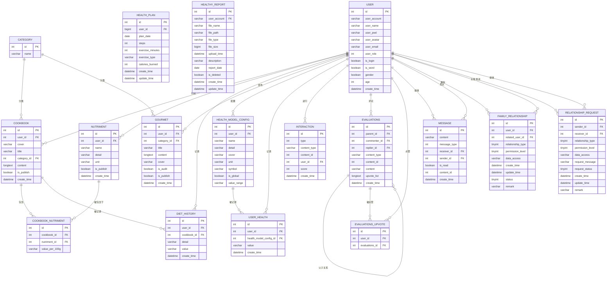

<div align="center">


### ⚡ 蝶启新生 - 芙芙健康管家 v0.1 | 内测开启 ⚡

[](https://deepwiki.com/Jenrimark/Health-Management)    

**一个基于 Spring Boot + Vue.js 的全栈健康管理系统**

提供个人健康数据管理、营养食谱推荐、健康计划制定、家庭健康管理等功能

<br/>

<a href="https://www.bilibili.com/video/BV11PgPzaEz1/" target="_blank">

</a>

<br/>


</div>

<br/>

---

## 📋 目录

- [项目简介](#-项目简介)
- [主要功能](#-主要功能)
- [系统架构](#-系统架构)
- [快速开始](#-快速开始)
- [项目结构](#-项目结构)
- [数据库设计](#-数据库设计)
- [API 文档](#-api-文档)
- [部署说明](#-部署说明)
- [贡献指南](#-贡献指南)
- [许可证](#-许可证)

## 🎯 项目简介

蝶启新生健康管理系统是一个现代化的健康管理平台，旨在帮助用户更好地管理个人和家庭的健康状况。系统集成了健康数据记录、智能食谱推荐、运动计划制定、健康报告生成等多项功能，为用户提供全方位的健康管理服务。

## ✨ 主要功能

<table>
<tr>
<td width="50%">

### 🏠 用户端

- **用户管理** — 注册、登录、个人信息管理
- **健康数据** — 血压、血糖、体重等指标记录与追踪
- **健康计划** — 个性化运动计划制定与执行跟踪
- **营养管理** — 食谱浏览、营养成分查看、饮食记录
- **健康报告** — 数据可视化分析与报告生成
- **家庭管理** — 家庭成员健康数据共享与管理
- **社交互动** — 健康资讯分享、评论互动
- **消息中心** — 系统通知、健康提醒

</td>
<td width="50%">

### 🔧 管理端

- **用户管理** — 用户信息管理、权限控制
- **内容管理** — 食谱管理、营养素管理、健康资讯管理
- **数据统计** — 用户数据统计、系统使用情况分析
- **系统配置** — 健康模型配置、系统参数设置

</td>
</tr>
</table>

## 🏗 系统架构

```
┌─────────────────┐    ┌─────────────────┐    ┌─────────────────┐
│   前端 (Vue.js)  │───▶│  后端 (Spring)   │───▶│  数据库 (MySQL)  │
│                 │    │                 │    │                 │
│ • 用户界面       │    │ • RESTful API   │    │ • 用户数据       │
│ • 数据可视化     │    │ • 业务逻辑       │    │ • 健康记录       │
│ • 交互体验       │    │ • 数据处理       │    │ • 食谱数据       │
└─────────────────┘    └─────────────────┘    └─────────────────┘
```

## 🚀 快速开始

### 环境要求

| 依赖 | 版本 |
|------|------|
| JDK | 1.8+ |
| Node.js | 14.0+ |
| MySQL | 8.0+ |
| Maven | 3.6+ |

### 1. 克隆项目

```bash
git clone https://github.com/Jenrimark/Health-Management.git
cd Health-Management
```

### 2. 初始化数据库

```sql
CREATE DATABASE personal_health CHARACTER SET utf8mb4 COLLATE utf8mb4_bin;
```

```bash
mysql -u root -p personal_health < personal_health.sql
```

### 3. 启动后端

```bash
cd personal-health-api
# 修改 src/main/resources/application.yml 中的数据库配置
mvn clean install
mvn spring-boot:run
```

后端服务运行在 `http://localhost:8080/api/personal-heath/v1.0`

### 4. 启动前端

```bash
cd personal-heath-view
npm install
npm run serve
```

前端页面访问 `http://localhost:8080`

## 📁 项目结构

```
Health-Management/
├── personal-health-api/              # 后端 (Spring Boot)
│   └── src/main/java/cn/kmbeast/
│       ├── controller/               # 控制器层
│       ├── service/                  # 服务层
│       ├── mapper/                   # 数据访问层 (MyBatis)
│       ├── pojo/                     # 实体类
│       ├── utils/                    # 工具类
│       └── config/                   # 配置类
│
├── personal-heath-view/              # 前端 (Vue.js)
│   └── src/
│       ├── components/               # 公共组件
│       ├── views/                    # 页面组件
│       ├── router/                   # 路由配置
│       ├── utils/                    # 工具函数
│       └── assets/                   # 静态资源
│
├── personal_health.sql               # 数据库脚本
├── personal_health 简化版.sql         # 简化版数据库脚本
└── README.md
```

## 📊 数据库设计

### 核心数据表

| 模块 | 表名 | 说明 |
|------|------|------|
| **用户** | `user` | 用户基本信息 |
| | `family_relationship` | 家庭关系管理 |
| | `relationship_request` | 关系请求 |
| **健康** | `health_model_config` | 健康模型配置 |
| | `user_health` | 用户健康数据 |
| | `health_plan` | 健康计划 |
| | `healthy_report` | 健康报告 |
| **营养** | `cookbook` | 食谱信息 |
| | `nutriment` | 营养素 |
| | `cookbook_nutriment` | 食谱营养关联 |
| | `diet_history` | 饮食记录 |
| | `category` | 食物分类 |
| **社交** | `gourmet` | 美食资讯 |
| | `evaluations` | 评论系统 |
| | `interaction` | 用户互动 |
| | `message` | 消息通知 |

<details>
<summary>📐 查看 ER 图</summary>


```mermaid
erDiagram
    USER {
        int id PK
        varchar user_account
        varchar user_name
        varchar user_pwd
        varchar user_avatar
        varchar user_email
        int user_role
        boolean is_login
        boolean is_word
        boolean gender
        int age
        datetime create_time
    }

    HEALTH_MODEL_CONFIG {
        int id PK
        int user_id FK
        varchar name
        varchar detail
        varchar cover
        varchar unit
        varchar symbol
        boolean is_global
        varchar value_range
    }

    USER_HEALTH {
        int id PK
        int user_id FK
        int health_model_config_id FK
        varchar value
        datetime create_time
    }

    HEALTH_PLAN {
        int id PK
        bigint user_id FK
        date plan_date
        int steps
        int exercise_minutes
        varchar exercise_type
        int calories_burned
        datetime create_time
        datetime update_time
    }

    HEALTHY_REPORT {
        int id PK
        varchar user_account FK
        varchar file_name
        varchar file_path
        varchar file_type
        bigint file_size
        datetime upload_time
        varchar description
        date report_date
        boolean is_deleted
        datetime create_time
        datetime update_time
    }

    CATEGORY {
        int id PK
        varchar name
    }

    COOKBOOK {
        int id PK
        int user_id FK
        varchar cover
        varchar title
        int category_id FK
        longtext content
        boolean is_publish
        datetime create_time
    }

    NUTRIMENT {
        int id PK
        int user_id FK
        varchar name
        varchar detail
        varchar unit
        boolean is_publish
        datetime create_time
    }

    COOKBOOK_NUTRIMENT {
        int id PK
        int cookbook_id FK
        int nutriment_id FK
        varchar value_per_100g
    }

    DIET_HISTORY {
        int id PK
        int user_id FK
        int cookbook_id FK
        varchar detail
        varchar value
        datetime create_time
    }

    GOURMET {
        int id PK
        int user_id FK
        int category_id FK
        varchar title
        longtext content
        varchar cover
        boolean is_audit
        boolean is_publish
        datetime create_time
    }

    EVALUATIONS {
        int id PK
        int parent_id FK
        int commenter_id FK
        int replier_id FK
        varchar content_type
        int content_id
        varchar content
        longtext upvote_list
        datetime create_time
    }

    EVALUATIONS_UPVOTE {
        int id PK
        int user_id FK
        int evaluations_id FK
    }

    INTERACTION {
        int id PK
        int type
        varchar content_type
        int content_id
        int user_id FK
        int score
        datetime create_time
    }

    MESSAGE {
        int id PK
        varchar content
        int message_type
        int receiver_id FK
        int sender_id FK
        boolean is_read
        int content_id
        datetime create_time
    }

    FAMILY_RELATIONSHIP {
        int id PK
        int user_id FK
        int related_user_id FK
        tinyint relationship_type
        tinyint permission_level
        varchar data_access
        datetime create_time
        datetime update_time
        tinyint status
        varchar remark
    }

    RELATIONSHIP_REQUEST {
        int id PK
        int sender_id FK
        int receiver_id FK
        tinyint relationship_type
        tinyint permission_level
        varchar data_access
        varchar request_message
        tinyint request_status
        datetime create_time
        datetime update_time
        varchar remark
    }

    USER ||--o{ COOKBOOK : "创建"
    USER ||--o{ NUTRIMENT : "创建"
    USER ||--o{ DIET_HISTORY : "记录"
    USER ||--o{ GOURMET : "发布"
    USER ||--o{ HEALTH_MODEL_CONFIG : "配置"
    USER ||--o{ USER_HEALTH : "记录"
    USER ||--o{ INTERACTION : "进行"
    USER ||--o{ EVALUATIONS : "评论"
    USER ||--o{ EVALUATIONS_UPVOTE : "点赞"
    USER ||--o{ MESSAGE : "接收"
    USER ||--o{ MESSAGE : "发送"
    USER ||--o{ FAMILY_RELATIONSHIP : "拥有"
    USER ||--o{ FAMILY_RELATIONSHIP : "关联"
    USER ||--o{ RELATIONSHIP_REQUEST : "发送"
    USER ||--o{ RELATIONSHIP_REQUEST : "接收"

    CATEGORY ||--o{ COOKBOOK : "分类"
    CATEGORY ||--o{ GOURMET : "分类"
    COOKBOOK ||--o{ COOKBOOK_NUTRIMENT : "包含"
    NUTRIMENT ||--o{ COOKBOOK_NUTRIMENT : "被包含于"
    COOKBOOK ||--o{ DIET_HISTORY : "被记录"
    HEALTH_MODEL_CONFIG ||--o{ USER_HEALTH : "被记录"
    EVALUATIONS ||--o{ EVALUATIONS : "父子关系"
    EVALUATIONS ||--o{ EVALUATIONS_UPVOTE : "被点赞"
```

</details>

## 📡 API 文档

<details>
<summary>👤 用户管理</summary>

| 方法 | 路径 | 说明 |
|------|------|------|
| `POST` | `/user/login` | 用户登录 |
| `POST` | `/user/register` | 用户注册 |
| `GET` | `/user/info` | 获取用户信息 |
| `PUT` | `/user/update` | 更新用户信息 |

</details>

<details>
<summary>❤️ 健康管理</summary>

| 方法 | 路径 | 说明 |
|------|------|------|
| `GET` | `/health-model-config/query` | 查询健康模型配置 |
| `POST` | `/health-model-config/save` | 保存健康模型配置 |
| `POST` | `/user-health/save` | 保存健康数据 |
| `GET` | `/user-health/query` | 查询健康数据 |
| `POST` | `/health-plan/save` | 保存健康计划 |
| `GET` | `/health-plan/queryUser` | 查询用户健康计划 |

</details>

<details>
<summary>🥗 营养食谱</summary>

| 方法 | 路径 | 说明 |
|------|------|------|
| `GET` | `/cookbook/query` | 查询食谱 |
| `POST` | `/cookbook/userSave` | 用户保存食谱 |
| `GET` | `/nutriment/query` | 查询营养素 |
| `POST` | `/diet-history/save` | 保存饮食记录 |

</details>

<details>
<summary>💬 社交互动</summary>

| 方法 | 路径 | 说明 |
|------|------|------|
| `GET` | `/gourmet/query` | 查询美食资讯 |
| `POST` | `/gourmet/save` | 发布美食资讯 |
| `POST` | `/evaluations/save` | 发表评论 |
| `GET` | `/evaluations/query` | 查询评论 |

</details>

<details>
<summary>👨‍👩‍👧‍👦 家庭管理</summary>

| 方法 | 路径 | 说明 |
|------|------|------|
| `POST` | `/family-relationship/sendRequest` | 发送家庭关系请求 |
| `POST` | `/family-relationship/handleRequest` | 处理家庭关系请求 |
| `GET` | `/family-relationship/getFamily` | 获取家庭成员 |

</details>

## 🚢 部署说明

### 开发环境

```bash
# 后端
cd personal-health-api && mvn spring-boot:run

# 前端
cd personal-heath-view && npm run serve
```

### 生产环境

```bash
# 后端打包
cd personal-health-api && mvn clean package -Dmaven.test.skip=true

# 前端打包
cd personal-heath-view && npm run build

# 运行
java -jar personal-health-api/target/personal-health-api-1.0-SNAPSHOT.jar
# 前端静态文件部署到 Nginx
cp -r personal-heath-view/dist/* /var/www/html/
```

### Docker

```bash
docker build -t health-management .
docker run -p 8080:8080 health-management
```

<details>
<summary>📄 Dockerfile</summary>

```dockerfile
FROM openjdk:8-jre-alpine
COPY personal-health-api/target/personal-health-api-1.0-SNAPSHOT.jar app.jar
EXPOSE 8080
ENTRYPOINT ["java", "-jar", "/app.jar"]
```

</details>

## 🤝 贡献指南

欢迎所有形式的贡献！

1. **Fork** 本仓库
2. 创建特性分支：`git checkout -b feature/amazing-feature`
3. 提交修改：`git commit -m 'feat: add amazing feature'`
4. 推送分支：`git push origin feature/amazing-feature`
5. 打开 **Pull Request**

> 后端代码遵循 [阿里巴巴 Java 开发手册](https://github.com/alibaba/p3c)，前端代码遵循 Vue.js 官方风格指南，提交信息使用 [约定式提交](https://www.conventionalcommits.org/) 格式。

## 📄 许可证

本项目基于 [Apache License 2.0](LICENSE) 开源。

## 📞 联系方式

- **作者**：[Jenrimark](https://github.com/Jenrimark)
- **项目地址**：[https://github.com/Jenrimark/Health-Management](https://github.com/Jenrimark/Health-Management)

---

<div align="center">

**如果这个项目对你有帮助，请给个 ⭐ Star 支持一下！**

</div>
